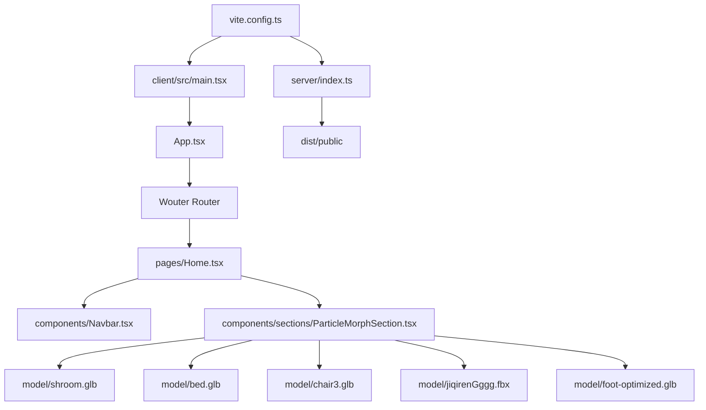

# 架构文档

> 本文档由 Codex 维护。最后更新于：2026-05-22

## 1. 项目概览

`fiber-sensor` 是一个基于 React + Vite + Three.js 的单页交互演示项目，用来展示模型粒子变形、滚轮触发的点云聚合切换以及柔性压力传感器的应用场景。当前首页已去掉原第一屏传感器主动画，进入页面后直接展示 `shroom.glb -> bed.glb -> chair3.glb -> jiqirenGggg.fbx -> foot-optimized.glb` 的粒子 morph 流程。开发态由 Vite 提供前端服务，生产态由一个极简 Express 服务托管 `dist/public` 静态资源。

## 2. 技术栈

| 分类 | 技术 | 版本/说明 |
| :--- | :--- | :--- |
| 前端框架 | React 19 | `react` + `react-dom` |
| 构建工具 | Vite 7 | 根 `dev/build/preview` 入口 |
| 3D 渲染 | Three.js | 当前首页使用 `client/src/components/sections/ParticleMorphSection.tsx`，旧传感器场景保留在 `client/src/components/hero` |
| 路由 | Wouter | SPA 路由切换 |
| 样式 | Tailwind CSS 4 | 配合自定义 `index.css` |
| 后端框架 | Express 4 | 仅用于生产态静态托管 |
| 语言 | TypeScript | 前后端均为 TS |
| 包管理器 | pnpm | 锁文件为 `pnpm-lock.yaml` |
| 其他关键库 | Framer Motion / GSAP / Radix UI / Recharts | 页面动画与 UI 组件基础设施 |

## 3. 目录结构

```text
.
├─ client/
│  ├─ public/
│  │  └─ __manus__/
│  ├─ src/
│  │  ├─ components/
│  │  │  ├─ hero/
│  │  │  ├─ sections/
│  │  │  └─ ui/
│  │  ├─ contexts/
│  │  ├─ hooks/
│  │  ├─ lib/
│  │  └─ pages/
├─ server/
├─ shared/
├─ patches/
├─ model/
├─ .webdev/
├─ vite.config.ts
└─ package.json
```

### 关键目录说明

| 目录 | 主要功能 |
| :--- | :--- |
| `client/src/pages` | 页面级路由组件，目前首页核心是 `Home.tsx` |
| `client/src/components/hero` | 旧版传感器主舞台，当前首页已不再渲染 |
| `client/src/components/sections` | 首页后续扩展 section，当前包含模型粒子变形场景 |
| `client/src/components/ui` | Radix/Shadcn 风格的基础 UI 组件 |
| `model` | 本地上传的 shroom、床、座椅、机器人、foot 模型资产，以及用于 morph 的 `foot-optimized.glb` 轻量版 |
| `server` | 生产环境静态托管入口 |
| `shared` | 前后端共享常量 |
| `patches` | pnpm patched dependency 文件 |

## 4. 核心模块与数据流

### 4.1 模块关系图



### 4.2 主要数据流

1. 首页渲染流程
   `main.tsx` 挂载 `App`，`wouter` 将 `/` 路由到 `Home`，首页当前渲染 `Navbar` 和懒加载的 `ParticleMorphSection`，原第一屏 `HeroSensorSection` 已从首页渲染链路移除。
2. 模型粒子变形流程
   `ParticleMorphSection` 通过 `GLTFLoader` / `FBXLoader` 读取本地 `shroom`、床、座椅、机器人、foot 模型，使用 `MeshSurfaceSampler` 采样表面点云；其中 `foot.glb` 体积过大，当前前端实际切到脚本生成的 `foot-optimized.glb` 轻量版。粒子序列现在直接以 `shroom` 形态开场，不再经过最开始的热力点云桥接，然后由滚轮按顺序触发 `shroom -> bed -> chair -> robot -> foot` 的完整 morph。每次过渡都带随机分批生成、完成后的短暂停顿，以及左到右 / 右到左交替的扫动方向；模型整体落点按左、右、左、右、左交替切换。bed 与 foot 的姿态和位置参数保留为内部默认预设，页面已去掉调参滑杆面板，左侧增加“对传感器的视觉表达，和场景衍生 -- SHROOM”主题文案；底部阶段标题改为 `SHROOM/SHROOM`、`关怀/床`、`定制/座椅`、`精密/机器人`、`LAB/足底`。bed 当前默认预设为 `47° / -119° / 0° / 3.76 / 2.06 / -0.80`，foot 当前默认预设为 `98° / 70° / -1° / -2.56 / 2.57 / -0.05`。

## 5. API 端点

当前仓库没有业务 API，仅有生产托管相关路由：

| 方法 | 路径 | 描述 |
| :--- | :--- | :--- |
| `GET` | `*` | 生产环境返回 `dist/public/index.html`，用于 SPA fallback |

## 6. 外部依赖与集成

| 服务/资源 | 用途 | 集成方式 |
| :--- | :--- | :--- |
| CloudFront 静态资源 | 加载布料纹理、logo、场景素材图 | 组件内直接使用远程 URL |
| Google Fonts | `Space Grotesk`、`JetBrains Mono` 字体 | `client/index.html` 引入 |
| Umami Analytics | 访问统计 | `client/index.html` 通过环境变量注入脚本地址 |
| OAuth Portal | 登录跳转 URL 生成 | `client/src/const.ts` 使用 `VITE_OAUTH_PORTAL_URL` 和 `VITE_APP_ID` |
| Frontend Forge API | 地图/位置相关能力 | `client/src/components/Map.tsx` 读取 API URL 与 KEY |

## 7. 环境变量

| 变量名 | 描述 | 示例 |
| :--- | :--- | :--- |
| `PORT` | 生产态 Express 监听端口 | `3000` |
| `NODE_ENV` | 运行环境 | `production` |
| `VITE_OAUTH_PORTAL_URL` | OAuth 门户地址 | `https://example.com` |
| `VITE_APP_ID` | OAuth 应用 ID | `fiber-sensor-demo` |
| `VITE_FRONTEND_FORGE_API_KEY` | Forge API Key | `xxxx` |
| `VITE_FRONTEND_FORGE_API_URL` | Forge API 基础地址 | `https://forge.butterfly-effect.dev` |
| `VITE_ANALYTICS_ENDPOINT` | Umami 脚本前缀 | `https://analytics.example.com` |
| `VITE_ANALYTICS_WEBSITE_ID` | Umami 站点 ID | `xxxxxxxx-xxxx-xxxx-xxxx-xxxxxxxxxxxx` |

## 8. 项目进度

| 完成日期 | 完成的功能/工作 | 说明 |
| :--- | :--- | :--- |
| 2026-04-16 | 单页传感器演示首页 | 建立 React/Vite 首页与深色视觉基调 |
| 2026-04-16 | 6 段滚动 Three.js 主场景 | 完成纤维成线、织网、成型、受压、读出等阶段动画 |
| 2026-04-17 | 品牌贴花透明化 | 将产品 logo 从整张底图拆成透明 decal，并同步修正导航 logo 渲染 |
| 2026-04-17 | 点云最终镜头修复 | 收敛点云高度映射并拉远第 6 段相机，避免最终点图被裁切 |
| 2026-04-21 | 模型粒子变形段 | 在现有主动画后追加床、座椅、机器人粒子 morph section，并接入本地 `glb/fbx` 模型 |
| 2026-04-21 | 粒子场景可见性修复 | 修正模型采样点的世界坐标转换，并改成首个模型采样完成后立即开始显示粒子形态，避免被后续大体积模型阻塞 |
| 2026-04-21 | 热力点云桥接床垫 | 将第一屏末尾的 3D 点云视角接入第二段，先收束到床垫，再进入模型 morph，并支持鼠标控制切换节奏 |
| 2026-04-21 | 方向扫动粒子变形 | 模型切换改为按 X 方向波前扫过，左右方向交替，突出粒子从左到右和从右到左的换形过程 |
| 2026-04-21 | 鼠标位置控制模型区间 | 床垫到座椅、座椅到机器人的变形改为由鼠标横向位置直接驱动，不再依赖自动时间循环 |
| 2026-04-21 | 鼠标纵向驱动切换 | 将模型区间控制从横向鼠标位置改为纵向位置，向下移动依次推进到座椅和机器人 |
| 2026-04-21 | 滚轮驱动模型切换 | 将模型区间控制改为鼠标滚轮累积进度，滚轮向下依次推进床垫、座椅、机器人 |
| 2026-04-21 | 模型左右交替落位 | 让床垫、座椅、机器人在 morph 时按左、右、左的整体位置交替出现，增强左右切换展示感 |
| 2026-04-21 | 参考 Demo 放缓节奏 | 参考 `3d-particle-scene-master` 收低滚轮推进灵敏度、加宽扫动边界，并放慢粒子跟随速度 |
| 2026-04-21 | 参考 Demo 拉大间距 | 参考 `3d-particle-scene-master` 提高模型左右落位偏移，并收敛相机横向跟随幅度，让左右分布更明显 |
| 2026-04-21 | 加入停顿与分批生成 | 参考 `3d-particle-scene-master` 把滚轮交互改为单次触发的完整过渡，增加随机分批生成和过渡完成后的停顿时间 |
| 2026-04-21 | 首模型切换为蘑菇 | 将第二段第一个目标模型从 `bed.glb` 替换为 `蘑菇.obj`，并补充 `OBJLoader` 支持 |
| 2026-04-21 | 直接从 shroom 开场的四段 morph | 删除第二段最开始的热力点云桥接，改为直接显示 `shroom.glb`，并把顺序补成 `shroom -> bed -> chair -> robot` |
| 2026-04-23 | Foot 接到机器人后 | 在 `ParticleMorphSection` 中新增 `foot.glb`，将模型链扩展为 `shroom -> bed -> chair -> robot -> foot` |
| 2026-04-23 | Foot 轻量化与姿态控制 | 为 `foot.glb` 生成 `foot-optimized.glb` 轻量版，并在粒子场景中增加 `Foot Tilt X / Y / Z` 控制 |
| 2026-04-23 | 修复 Foot 轻量版 GLB 格式 | 修正 `optimize_foot_glb.py` 对 JSON chunk 的填充方式，避免 `foot-optimized.glb` 被 `GLTFLoader` 判定为无效文件 |
| 2026-04-23 | Foot 增加位置调节 | 为 foot morph 目标补充 `Foot Position X / Y / Z` 滑杆，让脚模型支持独立平移微调 |
| 2026-05-22 | Foot 默认姿态预设 | 将 foot 的默认旋转和平移更新为 `98 / 70 / -1 / -2.56 / 2.57 / -0.05`，便于场景打开后直接落在目标构图 |
| 2026-05-22 | 移除首页第一屏动画 | 从 `Home.tsx` 移除 `HeroSensorSection`，让首页直接进入模型粒子 morph 场景 |
| 2026-05-22 | Bed 增加姿态与位置调节 | 为 bed morph 目标补充 `Bed Controls` 面板，支持三轴旋转和三轴位置实时微调 |
| 2026-05-22 | Bed 默认姿态预设 | 将 bed 的默认旋转和平移更新为 `47 / -119 / 0 / 3.76 / 2.06 / -0.80`，便于床垫阶段直接使用目标构图 |
| 2026-05-22 | 精简粒子场景界面 | 移除左侧文案和调参滑杆，将底部阶段标题更新为 `SHROOM/SHROOM`、`关怀/床`、`定制/座椅`、`精密/机器人`、`LAB/足底` |
| 2026-05-22 | 增加左侧主题文案 | 在粒子场景左侧增加“对传感器的视觉表达，和场景衍生 -- SHROOM”，并放大 SHROOM 品牌字样以补足画面信息密度 |

## 9. 更新日志

| 日期 | 变更类型 | 描述 |
| :--- | :--- | :--- |
| 2026-04-17 | 初始化 | 创建项目架构文档 |
| 2026-04-17 | 修复缺陷 | 修复导航/logo 透明背景问题，并调整最终 3D 点云镜头与高度映射 |
| 2026-04-21 | 新增功能 | 在首页主动画后新增模型粒子变形 section，接入 `bed.glb`、`chair3.glb`、`jiqirenGggg.fbx` |
| 2026-04-21 | 修复缺陷 | 修正粒子采样坐标空间错误，并将模型加载切为渐进式显示，保证床模型就绪后即可看到粒子聚合 |
| 2026-04-21 | 优化重构 | 将 `ParticleMorphSection` 改为热力点云到床垫的桥接动画，后续模型粒子切换由鼠标横向移动控制节奏 |
| 2026-04-21 | 优化重构 | 将模型粒子 morph 改为沿 X 方向的左右交替扫动，并把第二段开场相机对齐到第一屏末尾点图视角 |
| 2026-04-21 | 优化重构 | 将床垫、座椅、机器人的 morph 从自动轮播改为鼠标位置驱动，左中右分别对应三种主要形态区间 |
| 2026-04-21 | 优化重构 | 将床垫、座椅、机器人的 morph 控制轴改为鼠标上下位置，保留横向扫动作为粒子换形展示方向 |
| 2026-04-21 | 优化重构 | 将模型 morph 改为由鼠标滚轮驱动，并让每个模型目标位置按左、右、左交替落位 |
| 2026-04-21 | 优化重构 | 参考 `3d-particle-scene-master` 调低滚轮推进系数、放慢粒子追随速度，并把模型左右落位偏移从轻量展示改为明显分区 |
| 2026-04-21 | 优化重构 | 将滚轮控制从连续拖值改为单次触发完整 morph，加入随机延迟式粒子生成和生成结束后的 hold 时间，避免机器人未完整成型就被下一次输入打断 |
| 2026-04-21 | 优化重构 | 将第二段首个粒子目标由床垫改为 `蘑菇.obj`，同步更新加载器、界面文案和模型顺序说明 |
| 2026-04-21 | 优化重构 | 移除第二段开场的热力点云桥接，改成直接以 `shroom.glb` 的粒子形态开场，并接续 `bed -> chair -> robot` 的四段滚轮 morph |
| 2026-04-23 | 新增功能 | 将 `foot.glb` 作为新的粒子 morph 目标接到机器人后面，首页第二段更新为 `Mushroom / Bed / Chair / Robot / Foot` 五段滚轮切换 |
| 2026-04-23 | 优化重构 | 新增 `scripts/optimize_foot_glb.py` 生成 `foot-optimized.glb`，把脚模型从约 160MB 压到约 1MB，并在 `ParticleMorphSection` 中加入 foot 三轴角度滑杆 |
| 2026-04-23 | 修复缺陷 | 修正 `scripts/optimize_foot_glb.py` 生成 GLB 时的 JSON chunk padding，解决 `foot-optimized.glb` 运行时加载失败问题 |
| 2026-04-23 | 新增功能 | 在 `ParticleMorphSection` 中为 foot 新增 `Foot Position X / Y / Z` 滑杆，并把平移偏移仅应用到 `FOOT` morph 目标 |
| 2026-05-22 | 配置变更 | 将 `ParticleMorphSection` 中 foot 的默认旋转和平移参数更新为 `98 / 70 / -1 / -2.56 / 2.57 / -0.05` |
| 2026-05-22 | 优化重构 | 去掉首页第一屏传感器动画渲染，`Home` 现在只保留导航和模型粒子 morph section |
| 2026-05-22 | 新增功能 | 为 `ParticleMorphSection` 新增 `Bed Controls`，并复用模型控制面板同时管理 bed 与 foot 的旋转和平移参数 |
| 2026-05-22 | 配置变更 | 将 `ParticleMorphSection` 中 bed 的默认旋转和平移参数更新为 `47 / -119 / 0 / 3.76 / 2.06 / -0.80` |
| 2026-05-22 | 优化重构 | 移除 `ParticleMorphSection` 左侧说明文字和滑杆 UI，保留内部默认参数，并重命名底部阶段标题 |
| 2026-05-22 | 界面优化 | 在 `ParticleMorphSection` 左侧补充 SHROOM 主题文案，并放大 SHROOM 字样，保持主画面留白但降低空旷感 |
