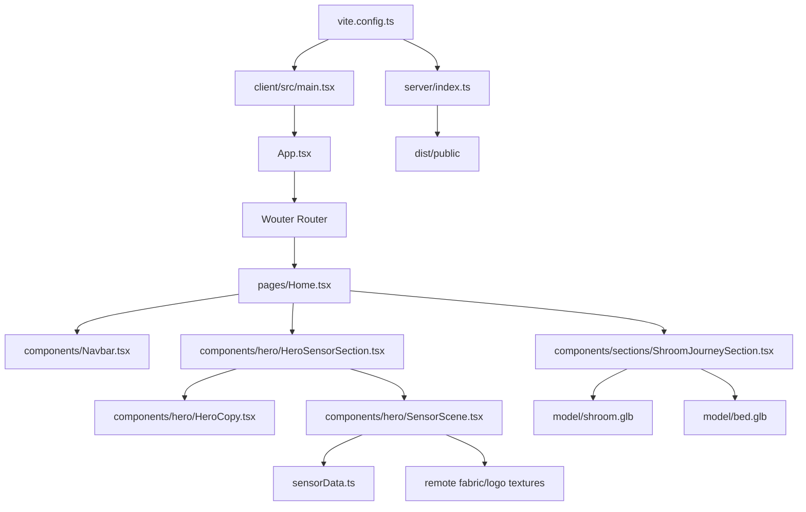

# 架构文档

> 本文档由 Codex 维护。最后更新于：2026-04-23

## 1. 项目概览

`fiber-sensor` 是一个基于 React + Vite + Three.js 的单页交互演示项目，用来展示纤维压力传感器的 6 段滚动叙事、3D 受压形变以及最终的压力点云读出效果。当前首页先拆成 `矩侨 / Shroom` 双入口：`矩侨` 路径继续承载柔性、小点距、可死折的主传感器电影式首屏，`Shroom` 路径则进入一个新的两步滚轮剧情，先以正中间的实体蘑菇作为 loading core 并延长停留，再溶解成粒子蘑菇；第一次向下滚轮会直接把粒子动画到屏幕右侧更偏正面的长矩形床垫，并让床沿长边平行于屏幕、整体再向屏幕内倾约 `45°`，第二次向下滚轮才触发同点三连击，并在第三次击打结束后于右侧抬出恢复到上一版大小、但纵向拉伸为两倍高度的 `SOS` 通知粒子弹窗。该路线还新增了一个实时调节面板，可用进度条直接微调床垫的三轴角度和三轴位置；默认床垫参数已经切到 `Tilt X -22 / Tilt Y 29 / Tilt Z 32 / Position X 1.90 / Position Y -0.90 / Position Z -0.08`，同时 `SOS` 与拍打波环会跟着当前床垫参数联动。最新一轮又把 `SOS` 整体放大到 `130%`，并向右平移一个当前面板宽度；拍打环也改成直接读取床垫旋转后的世界锚点，避免和床垫表面错位。床阶段的相机也已经改成固定构图，不再随着床垫位置滑杆持续跟随。开发态由 Vite 提供前端服务，生产态由一个极简 Express 服务托管 `dist/public` 静态资源。

## 2. 技术栈

| 分类 | 技术 | 版本/说明 |
| :--- | :--- | :--- |
| 前端框架 | React 19 | `react` + `react-dom` |
| 构建工具 | Vite 7 | 根 `dev/build/preview` 入口 |
| 3D 渲染 | Three.js | `client/src/components/hero/SensorScene.tsx` + `client/src/components/sections/ShroomJourneySection.tsx` |
| 路由 | Wouter | SPA 路由切换 |
| 样式 | Tailwind CSS 4 | 配合自定义 `index.css` |
| 后端框架 | Express 4 | 仅用于生产态静态托管 |
| 语言 | TypeScript | 前后端均为 TS |
| 包管理器 | pnpm | 锁文件为 `pnpm-lock.yaml` |
| 其他关键库 | Framer Motion / GSAP / Radix UI / Recharts | 页面动画与 UI 组件基础设施 |

## 3. 目录结构

```text
.
├─ client/
│  ├─ public/
│  │  └─ __manus__/
│  ├─ src/
│  │  ├─ components/
│  │  │  ├─ hero/
│  │  │  ├─ sections/
│  │  │  └─ ui/
│  │  ├─ contexts/
│  │  ├─ hooks/
│  │  ├─ lib/
│  │  └─ pages/
├─ server/
├─ shared/
├─ patches/
├─ model/
├─ .webdev/
├─ vite.config.ts
└─ package.json
```

### 关键目录说明

| 目录 | 主要功能 |
| :--- | :--- |
| `client/src/pages` | 页面级路由组件，目前首页核心是 `Home.tsx`，负责双入口选择与模式切换 |
| `client/src/components/hero` | 首页主舞台，包含滚动容器、Three.js 场景、HUD 和传感器数据 |
| `client/src/components/sections` | 首页扩展 section，当前激活的是 `ShroomJourneySection.tsx` 的蘑菇 loading / 床垫拍打 / SOS 粒子剧情 |
| `client/src/components/ui` | Radix/Shadcn 风格的基础 UI 组件 |
| `model` | 本地上传的 shroom、床、座椅、机器人模型资产 |
| `server` | 生产环境静态托管入口 |
| `shared` | 前后端共享常量 |
| `patches` | pnpm patched dependency 文件 |

## 4. 核心模块与数据流

### 4.1 模块关系图



### 4.2 主要数据流

1. 首页渲染流程
   `main.tsx` 挂载 `App`，`wouter` 将 `/` 路由到 `Home`；`Home` 先渲染双入口门户，再根据本地状态切换到 `矩侨` 的 `HeroSensorSection` 或 `Shroom` 的 `ShroomJourneySection`。
2. 滚动驱动首页产品片
   `HeroSensorSection` 监听窗口滚动并计算 `scrollProgress`，再把该进度同时传给 `SensorScene` 与 `HeroCopy`，让 3D 场景、阶段文案和核心卖点卡片共用同一条滚动时间轴。
3. 传感器数据驱动可视化
   `SensorScene` 在 `updateScene` 中读取 `SENSOR_FRAMES`，将 32x32 原始压力数据插值、平滑后驱动产品形变、热图叠加层和最终点云高度/颜色。
4. 产品表面纹理叠加
   产品表面基础纹理来自 `FABRIC_TEXTURE_URL`，品牌 logo 通过透明 PNG 作为单独 decal 贴在产品表面，避免白底被烘进底图。
5. Shroom 两屏流程
   `ShroomJourneySection` 通过 `GLTFLoader` 读取本地 `shroom.glb` 与 `bed.glb`，先把实体蘑菇居中渲染为 loading core，并在床垫采样完成后额外延长一段等待时间；随后再用 `MeshSurfaceSampler` 把蘑菇和床垫采样成同一批粒子目标，让实体蘑菇溶解成粒子蘑菇。交互改成离散的两次滚轮：第一次向下滚轮直接触发粒子到屏幕右侧的床垫完整动画，床本体保持更接近正面的长矩形视角，长边基本平行于屏幕，再整体向屏幕内倾约 `45°`；第二次向下滚轮才以更慢的节奏在同一击打点连续触发三次冲击波与起伏，等三连击完成后，再以恢复到上一版大小、纵向拉伸为双倍高度的 `SOS` 粒子字和背后的通知式弹窗面板，在屏幕右侧渐进浮现。页面底部同时提供一个床垫调节面板，允许实时拖动 `Tilt X / Tilt Y / Tilt Z` 与 `Position X / Position Y / Position Z` 六条滑杆，其中三轴旋转范围现已统一放宽到 `-360° ~ 360°`；当前默认值采用 `-22 / 29 / 32 / 1.90 / -0.90 / -0.08` 这组参数。`SOS` 文字与通知面板会在这套默认锚点基础上整体放大到 `130%`，再向右平移一个当前面板宽度；拍打波环则改成直接使用床垫点云组当前的旋转后世界坐标和法线朝向，和床垫表面保持对应。镜头则保持固定床阶段构图，只保留轻微鼠标漂移，不再跟着床垫位置调节持续追焦。

## 5. API 端点

当前仓库没有业务 API，仅有生产托管相关路由：

| 方法 | 路径 | 描述 |
| :--- | :--- | :--- |
| `GET` | `*` | 生产环境返回 `dist/public/index.html`，用于 SPA fallback |

## 6. 外部依赖与集成

| 服务/资源 | 用途 | 集成方式 |
| :--- | :--- | :--- |
| CloudFront 静态资源 | 加载布料纹理、logo、场景素材图 | 组件内直接使用远程 URL |
| Google Fonts | `Space Grotesk`、`JetBrains Mono` 字体 | `client/index.html` 引入 |
| Umami Analytics | 访问统计 | `client/index.html` 通过环境变量注入脚本地址 |
| OAuth Portal | 登录跳转 URL 生成 | `client/src/const.ts` 使用 `VITE_OAUTH_PORTAL_URL` 和 `VITE_APP_ID` |
| Frontend Forge API | 地图/位置相关能力 | `client/src/components/Map.tsx` 读取 API URL 与 KEY |

## 7. 环境变量

| 变量名 | 描述 | 示例 |
| :--- | :--- | :--- |
| `PORT` | 生产态 Express 监听端口 | `3000` |
| `NODE_ENV` | 运行环境 | `production` |
| `VITE_OAUTH_PORTAL_URL` | OAuth 门户地址 | `https://example.com` |
| `VITE_APP_ID` | OAuth 应用 ID | `fiber-sensor-demo` |
| `VITE_FRONTEND_FORGE_API_KEY` | Forge API Key | `xxxx` |
| `VITE_FRONTEND_FORGE_API_URL` | Forge API 基础地址 | `https://forge.butterfly-effect.dev` |
| `VITE_ANALYTICS_ENDPOINT` | Umami 脚本前缀 | `https://analytics.example.com` |
| `VITE_ANALYTICS_WEBSITE_ID` | Umami 站点 ID | `xxxxxxxx-xxxx-xxxx-xxxx-xxxxxxxxxxxx` |

## 8. 项目进度

| 完成日期 | 完成的功能/工作 | 说明 |
| :--- | :--- | :--- |
| 2026-04-16 | 单页传感器演示首页 | 建立 React/Vite 首页与深色视觉基调 |
| 2026-04-16 | 6 段滚动 Three.js 主场景 | 完成纤维成线、织网、成型、受压、读出等阶段动画 |
| 2026-04-17 | 品牌贴花透明化 | 将产品 logo 从整张底图拆成透明 decal，并同步修正导航 logo 渲染 |
| 2026-04-17 | 点云最终镜头修复 | 收敛点云高度映射并拉远第 6 段相机，避免最终点图被裁切 |
| 2026-04-21 | 模型粒子变形段 | 在现有主动画后追加床、座椅、机器人粒子 morph section，并接入本地 `glb/fbx` 模型 |
| 2026-04-21 | 粒子场景可见性修复 | 修正模型采样点的世界坐标转换，并改成首个模型采样完成后立即开始显示粒子形态，避免被后续大体积模型阻塞 |
| 2026-04-21 | 热力点云桥接床垫 | 将第一屏末尾的 3D 点云视角接入第二段，先收束到床垫，再进入模型 morph，并支持鼠标控制切换节奏 |
| 2026-04-21 | 方向扫动粒子变形 | 模型切换改为按 X 方向波前扫过，左右方向交替，突出粒子从左到右和从右到左的换形过程 |
| 2026-04-21 | 鼠标位置控制模型区间 | 床垫到座椅、座椅到机器人的变形改为由鼠标横向位置直接驱动，不再依赖自动时间循环 |
| 2026-04-21 | 鼠标纵向驱动切换 | 将模型区间控制从横向鼠标位置改为纵向位置，向下移动依次推进到座椅和机器人 |
| 2026-04-21 | 滚轮驱动模型切换 | 将模型区间控制改为鼠标滚轮累积进度，滚轮向下依次推进床垫、座椅、机器人 |
| 2026-04-21 | 模型左右交替落位 | 让床垫、座椅、机器人在 morph 时按左、右、左的整体位置交替出现，增强左右切换展示感 |
| 2026-04-21 | 参考 Demo 放缓节奏 | 参考 `3d-particle-scene-master` 收低滚轮推进灵敏度、加宽扫动边界，并放慢粒子跟随速度 |
| 2026-04-21 | 参考 Demo 拉大间距 | 参考 `3d-particle-scene-master` 提高模型左右落位偏移，并收敛相机横向跟随幅度，让左右分布更明显 |
| 2026-04-21 | 加入停顿与分批生成 | 参考 `3d-particle-scene-master` 把滚轮交互改为单次触发的完整过渡，增加随机分批生成和过渡完成后的停顿时间 |
| 2026-04-21 | 首模型切换为蘑菇 | 将第二段第一个目标模型从 `bed.glb` 替换为 `蘑菇.obj`，并补充 `OBJLoader` 支持 |
| 2026-04-21 | 直接从 shroom 开场的四段 morph | 删除第二段最开始的热力点云桥接，改为直接显示 `shroom.glb`，并把顺序补成 `shroom -> bed -> chair -> robot` |
| 2026-04-22 | 首屏广告片信息层与应用能力卡 | 将第一段改成卖点随滚动联动的产品片信息层，并为第二段补充床、座椅、机器人实时能力说明卡 |
| 2026-04-22 | 双入口首页与 Shroom SOS 剧情 | 首页拆成 `矩侨 / Shroom` 双入口，并为 `Shroom` 新增延长 loading、粒子蘑菇、同点三连击床垫和小型 `SOS` 弹窗粒子报警的两屏流程 |
| 2026-04-22 | Shroom 节奏与提示层收紧 | 将 `Shroom` 路径的三连击拍打拉慢拉开，并把 `SOS` 缩成通知式小弹窗，明确放到三连击结束后再出现 |
| 2026-04-22 | Shroom 改成两次滚轮分步触发 | 第一次滚轮直接动画到倾斜床垫，第二次滚轮再触发三连击与延后出现的 `SOS` 通知粒子弹窗 |
| 2026-04-22 | Shroom SOS 尺寸微调 | 将第二次滚轮后的 `SOS` 通知粒子字和弹窗面板略微放大，保持通知风格的同时提升可读性 |
| 2026-04-22 | Shroom 左侧构图与床朝向修正 | 将床模型与 `SOS` 弹窗都压到屏幕左侧，把床阶段收成朝屏幕内约 `45°` 的构图，并把 `SOS` 尺寸回退到上一版大小 |
| 2026-04-22 | Shroom 右侧构图与床正面内倾修正 | 将床模型与 `SOS` 弹窗一起切到屏幕右侧，床阶段改成更接近正面长矩形的视角，并沿长边方向向屏幕内倾约 `45°` |
| 2026-04-23 | Shroom 床垫调节面板与 SOS 纵向拉伸 | 为 `ShroomJourneySection` 增加床垫三轴角度与三轴位置共六条实时滑杆，并把 `SOS` 粒子字与弹窗纵向高度提升到两倍 |
| 2026-04-23 | Shroom 角度控制补全为三轴 | 将床垫控制从单一倾角扩展为 `Tilt X / Tilt Y / Tilt Z`，补齐完整姿态调节能力 |
| 2026-04-23 | Shroom 扩大旋转范围并锁定镜头 | 放宽床垫三轴旋转滑杆区间，同时将床阶段相机改成固定构图，不再跟随模型位置滑杆持续追踪 |
| 2026-04-23 | Shroom 三轴旋转扩展到 360 度 | 将 `Tilt X / Tilt Y / Tilt Z` 的滑杆区间统一扩展到 `-360° ~ 360°` |
| 2026-04-23 | Shroom 默认姿态与联动锚点更新 | 将床垫默认参数改为 `-22 / 29 / 32 / 1.90 / -0.90 / -0.08`，并让 `SOS` 与拍打效果跟随床垫参数联动 |
| 2026-04-23 | Shroom SOS 放大右移并修正拍打对位 | 将 `SOS` 整体放大到 `130%`、向右平移一个当前宽度，并让拍打环改为使用床垫旋转后的世界锚点 |

## 9. 更新日志

| 日期 | 变更类型 | 描述 |
| :--- | :--- | :--- |
| 2026-04-17 | 初始化 | 创建项目架构文档 |
| 2026-04-17 | 修复缺陷 | 修复导航/logo 透明背景问题，并调整最终 3D 点云镜头与高度映射 |
| 2026-04-21 | 新增功能 | 在首页主动画后新增模型粒子变形 section，接入 `bed.glb`、`chair3.glb`、`jiqirenGggg.fbx` |
| 2026-04-21 | 修复缺陷 | 修正粒子采样坐标空间错误，并将模型加载切为渐进式显示，保证床模型就绪后即可看到粒子聚合 |
| 2026-04-21 | 优化重构 | 将 `ParticleMorphSection` 改为热力点云到床垫的桥接动画，后续模型粒子切换由鼠标横向移动控制节奏 |
| 2026-04-21 | 优化重构 | 将模型粒子 morph 改为沿 X 方向的左右交替扫动，并把第二段开场相机对齐到第一屏末尾点图视角 |
| 2026-04-21 | 优化重构 | 将床垫、座椅、机器人的 morph 从自动轮播改为鼠标位置驱动，左中右分别对应三种主要形态区间 |
| 2026-04-21 | 优化重构 | 将床垫、座椅、机器人的 morph 控制轴改为鼠标上下位置，保留横向扫动作为粒子换形展示方向 |
| 2026-04-21 | 优化重构 | 将模型 morph 改为由鼠标滚轮驱动，并让每个模型目标位置按左、右、左交替落位 |
| 2026-04-21 | 优化重构 | 参考 `3d-particle-scene-master` 调低滚轮推进系数、放慢粒子追随速度，并把模型左右落位偏移从轻量展示改为明显分区 |
| 2026-04-21 | 优化重构 | 将滚轮控制从连续拖值改为单次触发完整 morph，加入随机延迟式粒子生成和生成结束后的 hold 时间，避免机器人未完整成型就被下一次输入打断 |
| 2026-04-21 | 优化重构 | 将第二段首个粒子目标由床垫改为 `蘑菇.obj`，同步更新加载器、界面文案和模型顺序说明 |
| 2026-04-21 | 优化重构 | 移除第二段开场的热力点云桥接，改成直接以 `shroom.glb` 的粒子形态开场，并接续 `bed -> chair -> robot` 的四段滚轮 morph |
| 2026-04-22 | 优化重构 | 为 `HeroSensorSection` 接回广告片式信息层，强化柔性、小点距和可死折卖点，并为 `ParticleMorphSection` 增加床垫监控报警、座椅实时调节、机器人实时感应的联动说明卡 |
| 2026-04-22 | 新增功能 | 将首页改成 `矩侨 / Shroom` 双入口，并新增 `ShroomJourneySection`：先显示居中的实体蘑菇 loading，延长停留后溶解为粒子蘑菇，滚动 morph 到床垫，在同一点拍打三次，再渐进抬出更像弹窗的小型 `SOS` 粒子报警字 |
| 2026-04-22 | 优化重构 | 继续收紧 `ShroomJourneySection` 的时间轴：把三次拍打拉慢并完全让开 `SOS` 的出现时机，同时把 `SOS` 缩成更接近手机通知条的小型粒子弹窗 |
| 2026-04-22 | 优化重构 | 将 `ShroomJourneySection` 的交互从连续滚动进度改成离散滚轮步骤：第一次滚轮只负责蘑菇到倾斜床垫，第二次滚轮才播放三连击并在结束后抬出小号 `SOS` 通知弹窗 |
| 2026-04-22 | 优化重构 | 将 `ShroomJourneySection` 中的 `SOS` 粒子字和通知式弹窗做小幅放大，避免在三连击结束后出现得过小而影响辨识 |
| 2026-04-22 | 优化重构 | 将 `ShroomJourneySection` 的床与 `SOS` 都左移到屏幕左侧，并把床阶段收成朝屏幕内约 `45°` 的构图，同时把 `SOS` 尺寸回退到放大前的版本 |
| 2026-04-22 | 优化重构 | 将 `ShroomJourneySection` 的床与 `SOS` 一起切到屏幕右侧，并把床阶段收成更接近正面长矩形、沿长边向屏幕内倾约 `45°` 的构图 |
| 2026-04-23 | 优化重构 | 为 `ShroomJourneySection` 加入床垫三轴角度与三轴位置的实时调节滑杆，并把 `SOS` 粒子字和通知面板改成纵向双倍高度 |
| 2026-04-23 | 优化重构 | 将 `ShroomJourneySection` 的床垫控制从单一角度扩展为三轴旋转，允许独立调节 `Tilt X / Tilt Y / Tilt Z` |
| 2026-04-23 | 优化重构 | 扩大 `ShroomJourneySection` 床垫三轴旋转的可调范围，并把床阶段相机从跟随模型改成稳定的固定构图 |
| 2026-04-23 | 优化重构 | 将 `ShroomJourneySection` 的三轴旋转滑杆进一步扩展到完整 `-360° ~ 360°` 范围 |
| 2026-04-23 | 优化重构 | 将 `ShroomJourneySection` 的床垫默认值切换到用户指定参数，并让 `SOS` 锚点和拍打波环跟随床垫位置与姿态联动 |
| 2026-04-23 | 优化重构 | 将 `ShroomJourneySection` 的 `SOS` 统一放大到 `130%` 并向右平移一个当前宽度，同时把拍打特效改为基于床垫旋转后世界锚点的对位方案 |
